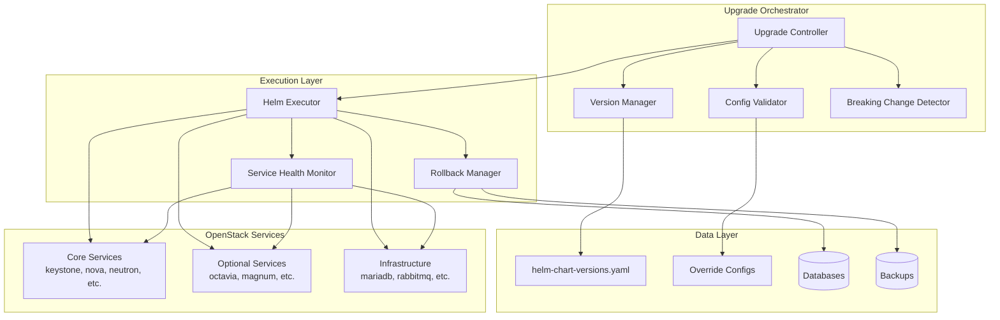
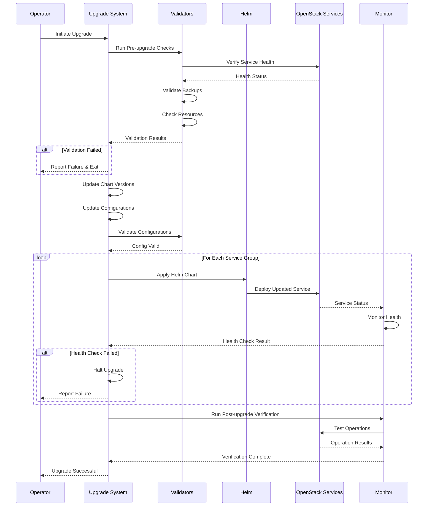

# Design Document: OpenStack Caracal to Epoxy Upgrade

## Overview

This design outlines the approach for upgrading a Genestack OpenStack deployment from Caracal (2024.1/2024.2) to Epoxy (2025.1). The upgrade leverages the SLURP (Skip Level Upgrade Release Process) capability of Epoxy, allowing direct upgrades from Caracal without intermediate releases.

The upgrade process consists of four main phases:
1. **Pre-upgrade validation** - Verify system health and readiness
2. **Chart and configuration updates** - Update helm chart versions and configurations
3. **Upgrade execution** - Apply updates in dependency order with health monitoring
4. **Post-upgrade verification** - Validate service functionality and performance

The design emphasizes safety through validation, incremental updates, comprehensive monitoring, and rollback capability.

## Architecture

### System Components



### Upgrade Flow



## Components and Interfaces

### 1. Upgrade Controller

**Purpose**: Orchestrates the entire upgrade process

**Interfaces**:
```python
class UpgradeController:
    def initiate_upgrade(self, config: UpgradeConfig) -> UpgradeResult:
        """Start the upgrade process"""
        
    def validate_prerequisites(self) -> ValidationResult:
        """Run all pre-upgrade validations"""
        
    def execute_upgrade(self) -> ExecutionResult:
        """Execute the upgrade in phases"""
        
    def verify_upgrade(self) -> VerificationResult:
        """Run post-upgrade verification"""
        
    def rollback(self) -> RollbackResult:
        """Rollback to previous state if needed"""
```

**Key Responsibilities**:
- Coordinate all upgrade phases
- Manage state transitions
- Handle errors and initiate rollback
- Generate upgrade reports

### 2. Version Manager

**Purpose**: Manage helm chart version updates

**Interfaces**:
```python
class VersionManager:
    def load_current_versions(self, path: str) -> Dict[str, str]:
        """Load current chart versions from YAML"""
        
    def identify_updates(self, current: Dict, target_release: str) -> List[VersionUpdate]:
        """Identify which charts need version updates"""
        
    def update_versions(self, updates: List[VersionUpdate]) -> UpdateResult:
        """Apply version updates to helm-chart-versions.yaml"""
        
    def generate_version_report(self) -> VersionReport:
        """Generate report of all version changes"""
```

**Version Update Strategy**:
- Parse helm-chart-versions.yaml
- Identify charts with Caracal versions (2024.1, 2024.2)
- Map to corresponding Epoxy versions (2025.1)
- Preserve non-OpenStack chart versions
- Write updated file atomically

### 3. Configuration Validator

**Purpose**: Validate helm override configurations for compatibility

**Interfaces**:
```python
class ConfigurationValidator:
    def scan_override_files(self, base_path: str) -> List[str]:
        """Find all helm override files"""
        
    def validate_override(self, file_path: str) -> ValidationResult:
        """Validate a single override file"""
        
    def check_image_tags(self, config: Dict) -> List[Issue]:
        """Check for outdated image tags"""
        
    def check_deprecated_options(self, config: Dict) -> List[Issue]:
        """Check for deprecated configuration options"""
        
    def generate_validation_report(self) -> ValidationReport:
        """Generate comprehensive validation report"""
```

**Validation Rules**:
- Image tags must reference 2025.1 versions
- Deprecated oslo.messaging options must be flagged
- Required configuration sections must be present
- Syntax must be valid YAML

### 4. Breaking Change Detector

**Purpose**: Identify and document breaking changes

**Interfaces**:
```python
class BreakingChangeDetector:
    def load_breaking_changes(self, release: str) -> List[BreakingChange]:
        """Load known breaking changes for release"""
        
    def analyze_impact(self, changes: List[BreakingChange], config: Dict) -> ImpactReport:
        """Analyze impact of breaking changes on current deployment"""
        
    def generate_mitigation_plan(self, impacts: ImpactReport) -> MitigationPlan:
        """Generate plan to address breaking changes"""
```

**Known Breaking Changes for Epoxy**:

1. **oslo.messaging Configuration Changes**:
   - `heartbeat_in_pthread` deprecated (warning in 2024.2, removal planned)
   - `kombu_ssl_*` options removed - use non-prefixed versions
   - Several options moved from `[DEFAULT]` to `[oslo_messaging_rabbit]`
   - AMQP1 driver removed

2. **Ironic Changes**:
   - PostgreSQL support removed - only MySQL/MariaDB supported

3. **Neutron Changes**:
   - Linux Bridge mechanism driver removed
   - Firewall v2 support added (optional)

4. **Python Version**:
   - Minimum Python 3.9 required (3.8 support removed)

### 5. Service Health Monitor

**Purpose**: Monitor service health during and after upgrade

**Interfaces**:
```python
class ServiceHealthMonitor:
    def check_pod_status(self, namespace: str) -> PodStatusReport:
        """Check status of all pods in namespace"""
        
    def check_api_endpoints(self, services: List[str]) -> EndpointReport:
        """Verify API endpoints are responding"""
        
    def check_service_lists(self) -> ServiceListReport:
        """Check OpenStack service lists (compute, network, volume)"""
        
    def test_operations(self, operations: List[Operation]) -> OperationReport:
        """Test key OpenStack operations"""
        
    def monitor_logs(self, services: List[str], duration: int) -> LogReport:
        """Monitor service logs for errors"""
```

**Health Check Criteria**:
- All pods in Running state
- All containers ready
- API endpoints return 200 OK
- Service lists show all agents/services as up/enabled
- Basic operations succeed (create/delete resources)
- No critical errors in logs

### 6. Helm Executor

**Purpose**: Execute helm chart deployments

**Interfaces**:
```python
class HelmExecutor:
    def apply_chart(self, chart: ChartSpec, overrides: List[str]) -> DeploymentResult:
        """Apply a helm chart with overrides"""
        
    def wait_for_ready(self, release: str, timeout: int) -> ReadyStatus:
        """Wait for helm release to be ready"""
        
    def get_release_status(self, release: str) -> ReleaseStatus:
        """Get status of a helm release"""
        
    def rollback_release(self, release: str, revision: int) -> RollbackResult:
        """Rollback a helm release to previous revision"""
```

**Deployment Strategy**:
- Apply charts in dependency order
- Wait for each deployment to stabilize
- Monitor pod rollout status
- Verify readiness probes pass
- Check for deployment errors

### 7. Rollback Manager

**Purpose**: Handle rollback to previous state

**Interfaces**:
```python
class RollbackManager:
    def create_backup(self, components: List[str]) -> BackupResult:
        """Create backup of current state"""
        
    def restore_versions(self, backup: Backup) -> RestoreResult:
        """Restore previous chart versions"""
        
    def restore_configurations(self, backup: Backup) -> RestoreResult:
        """Restore previous configurations"""
        
    def restore_databases(self, backup: Backup) -> RestoreResult:
        """Restore database backups if needed"""
        
    def verify_rollback(self) -> VerificationResult:
        """Verify rollback was successful"""
```

**Rollback Strategy**:
- Restore helm-chart-versions.yaml from backup
- Restore override configurations from backup
- Apply previous helm chart versions in reverse order
- Restore databases if schema changes occurred
- Verify all services return to healthy state

## Data Models

### UpgradeConfig

```python
@dataclass
class UpgradeConfig:
    source_release: str  # "2024.1" or "2024.2"
    target_release: str  # "2025.1"
    chart_versions_path: str  # Path to helm-chart-versions.yaml
    overrides_base_path: str  # Path to base-helm-configs/
    namespace: str  # Kubernetes namespace (default: "openstack")
    dry_run: bool  # If True, simulate without applying changes
    skip_optional_services: bool  # If True, only upgrade core services
    backup_path: str  # Path to store backups
    timeout_per_service: int  # Timeout in seconds for each service
```

### VersionUpdate

```python
@dataclass
class VersionUpdate:
    chart_name: str
    current_version: str
    target_version: str
    category: str  # "core", "optional", "infrastructure"
    dependencies: List[str]  # Charts that must be upgraded first
```

### ValidationResult

```python
@dataclass
class ValidationResult:
    passed: bool
    issues: List[ValidationIssue]
    warnings: List[str]
    timestamp: datetime
    
@dataclass
class ValidationIssue:
    severity: str  # "critical", "high", "medium", "low"
    component: str
    description: str
    remediation: str
```

### BreakingChange

```python
@dataclass
class BreakingChange:
    component: str  # Service name
    change_type: str  # "config", "api", "database", "dependency"
    description: str
    impact: str  # Description of impact
    mitigation: str  # How to address the change
    severity: str  # "critical", "high", "medium", "low"
    affects_deployment: bool  # True if this deployment is affected
```

### DeploymentResult

```python
@dataclass
class DeploymentResult:
    success: bool
    chart_name: str
    release_name: str
    revision: int
    duration: float  # seconds
    pod_status: Dict[str, str]  # pod_name -> status
    errors: List[str]
    warnings: List[str]
```

## Upgrade Sequence

### Phase 1: Pre-Upgrade Validation

1. **System Health Check**:
   - Verify all pods are Running
   - Check all OpenStack services are up
   - Verify API endpoints are accessible
   - Check for active migrations or jobs

2. **Resource Validation**:
   - Verify sufficient cluster resources (CPU, memory, storage)
   - Check for adequate disk space for backups
   - Verify network connectivity

3. **Backup Validation**:
   - Verify database backups exist and are recent
   - Create new backups if needed
   - Backup current helm-chart-versions.yaml
   - Backup all override configurations

4. **Configuration Analysis**:
   - Scan all override files
   - Identify deprecated options
   - Check for breaking changes
   - Generate pre-upgrade report

### Phase 2: Chart and Configuration Updates

1. **Version Updates**:
   - Load current helm-chart-versions.yaml
   - Identify charts requiring updates
   - Map Caracal versions to Epoxy versions
   - Write updated helm-chart-versions.yaml

2. **Configuration Updates**:
   - Update image tags in override files
   - Remove deprecated oslo.messaging options
   - Update configuration paths as needed
   - Validate updated configurations

3. **Breaking Change Mitigation**:
   - Apply required configuration changes
   - Update deprecated options
   - Document manual steps if needed

### Phase 3: Upgrade Execution

**Service Upgrade Order**:

1. **Infrastructure Services** (no downtime expected):
   - memcached
   - mariadb-operator (if version changed)
   - postgres-operator (if version changed)
   - rabbitmq (if version changed)

2. **Core Services** (brief API downtime):
   - keystone (identity)
   - glance (image)
   - placement
   - cinder (volume)
   - neutron (network)
   - nova (compute)
   - horizon (dashboard)

3. **Optional Services** (can be skipped):
   - barbican, blazar, ceilometer, cloudkitty
   - freezer, gnocchi, heat
   - ironic, magnum, manila, masakari
   - octavia, trove, zaqar

**Per-Service Upgrade Steps**:

1. Clean up existing jobs (for Nova):
   ```bash
   kubectl --namespace openstack delete jobs \
     $(kubectl --namespace openstack get jobs --no-headers \
     -o custom-columns=":metadata.name" | grep <service>)
   ```

2. Apply updated helm chart:
   ```bash
   helm upgrade --install <service> <chart> \
     --namespace openstack \
     --values base-helm-configs/<service>/<service>-helm-overrides.yaml \
     --timeout 10m \
     --wait
   ```

3. Monitor deployment:
   - Watch pod rollout status
   - Check readiness probes
   - Monitor service logs

4. Verify service health:
   - Check API endpoint
   - Verify service list
   - Test basic operations

5. Proceed to next service or halt on failure

### Phase 4: Post-Upgrade Verification

1. **Pod Status Check**:
   ```bash
   kubectl get pods --all-namespaces
   ```

2. **API Endpoint Verification**:
   ```bash
   openstack endpoint list
   ```

3. **Service List Verification**:
   ```bash
   openstack compute service list
   openstack network agent list
   openstack volume service list
   ```

4. **Functional Testing**:
   - Create test instance
   - Create test network
   - Create test volume
   - Attach volume to instance
   - Delete test resources

5. **Log Analysis**:
   - Check for critical errors
   - Verify no authentication failures
   - Check for database connection issues

6. **Performance Baseline**:
   - Compare API response times
   - Check resource utilization
   - Verify no performance degradation

## Correctness Properties

*A property is a characteristic or behavior that should hold true across all valid executions of a system—essentially, a formal statement about what the system should do. Properties serve as the bridge between human-readable specifications and machine-verifiable correctness guarantees.*


### Chart Version Management Properties

**Property 1: YAML Round-Trip Consistency**
*For any* valid helm-chart-versions.yaml file, reading the file, updating versions, writing the file, and reading again should produce a structurally equivalent result with updated versions.
**Validates: Requirements 1.1, 1.7**

**Property 2: OpenStack Service Identification**
*For any* list of helm charts, the Chart_Version_Manager should correctly identify which charts are OpenStack services based on known service names (keystone, nova, neutron, glance, cinder, etc.).
**Validates: Requirements 1.2**

**Property 3: Version String Replacement**
*For any* chart with a Caracal version string (containing "2024.1" or "2024.2"), the updated version should contain "2025.1" and preserve the chart name and other metadata.
**Validates: Requirements 1.3**

**Property 4: Version Report Completeness**
*For any* set of version updates performed, the generated report should contain an entry for each updated chart with old version, new version, and chart name.
**Validates: Requirements 1.8**

### Configuration Validation Properties

**Property 5: Override File Discovery**
*For any* directory structure containing YAML files, the Configuration_Validator should discover all files with .yaml or .yml extensions recursively.
**Validates: Requirements 2.1**

**Property 6: YAML Parsing Robustness**
*For any* syntactically valid YAML file, parsing should succeed and return a structured representation. For invalid YAML, parsing should fail with a descriptive error.
**Validates: Requirements 2.2**

**Property 7: Caracal Version Detection**
*For any* configuration containing image tags, all references to version strings "2024.1" or "2024.2" should be identified and flagged.
**Validates: Requirements 2.3**

**Property 8: Version Flag Mapping**
*For any* Caracal version tag identified, the system should generate a corresponding Epoxy version (2025.1) recommendation.
**Validates: Requirements 2.4**

**Property 9: Deprecated Option Detection**
*For any* configuration file, all deprecated options from a known deprecation list should be identified and reported.
**Validates: Requirements 2.5**

**Property 10: Deprecation Documentation Completeness**
*For any* deprecated option found, the report should include both the deprecated option name and its recommended replacement.
**Validates: Requirements 2.6**

**Property 11: Validation Report Completeness**
*For any* validation run that finds issues, the generated report should contain all identified issues with severity, description, and remediation.
**Validates: Requirements 2.8**

### Breaking Change Detection Properties

**Property 12: Breaking Change Catalog Completeness**
*For any* known breaking change in the Epoxy release, the Breaking_Change_Detector should include it in the generated report with component, description, impact, and mitigation.
**Validates: Requirements 3.1, 3.2, 3.3, 3.4, 3.5, 3.6, 3.7, 3.8**

### Pre-Upgrade Validation Properties

**Property 13: Service Health Aggregation**
*For any* set of OpenStack services, the health check should correctly aggregate individual service statuses and report overall health as healthy only if all services are healthy.
**Validates: Requirements 4.1**

**Property 14: Pod Status Classification**
*For any* set of Kubernetes pods, the system should correctly classify each pod as Running, Pending, Failed, or other states based on pod status.
**Validates: Requirements 4.2**

**Property 15: Endpoint Reachability Check**
*For any* set of API endpoints, the system should correctly determine which endpoints are responding (HTTP 200) and which are not.
**Validates: Requirements 4.3**

**Property 16: Validation Failure Halts Upgrade**
*For any* pre-upgrade validation that fails, the upgrade process should halt and not proceed to the upgrade phase.
**Validates: Requirements 4.8**

### Upgrade Execution Properties

**Property 17: Dependency Order Preservation**
*For any* set of services with defined dependencies, the upgrade order should ensure that all dependencies of a service are upgraded before that service.
**Validates: Requirements 5.1**

### Rollback Properties

**Property 18: Configuration Rollback Round-Trip**
*For any* set of configurations, backing up the configurations, modifying them, and then restoring from backup should result in the original configurations.
**Validates: Requirements 7.1, 7.2**

**Property 19: Version Rollback Round-Trip**
*For any* helm-chart-versions.yaml file, backing up the file, updating versions, and then restoring from backup should result in the original file content.
**Validates: Requirements 7.1**

### Logging and Reporting Properties

**Property 20: Action Logging Completeness**
*For any* upgrade action performed (version update, configuration change, service upgrade), the system should generate a log entry with timestamp, action type, and details.
**Validates: Requirements 8.1, 8.2, 8.3, 8.4**

**Property 21: Summary Report Completeness**
*For any* completed upgrade, the summary report should include all version changes, all configuration changes, total duration, and any issues encountered.
**Validates: Requirements 8.5, 8.6, 8.7**

## Error Handling

### Error Categories

1. **Validation Errors**:
   - Missing or corrupted configuration files
   - Invalid YAML syntax
   - Missing required fields
   - Incompatible versions

2. **Execution Errors**:
   - Helm deployment failures
   - Pod startup failures
   - Database migration failures
   - Timeout errors

3. **Health Check Errors**:
   - API endpoint unreachable
   - Service not responding
   - Resource exhaustion
   - Authentication failures

4. **Rollback Errors**:
   - Backup not found
   - Restore operation failed
   - Service won't start after rollback

### Error Handling Strategy

**Validation Phase**:
- Fail fast on critical validation errors
- Collect all validation issues before reporting
- Provide clear remediation steps
- Do not proceed to execution if validation fails

**Execution Phase**:
- Monitor each service deployment
- Set reasonable timeouts (10 minutes per service)
- Halt upgrade on first failure
- Preserve current state for rollback
- Log all errors with context

**Rollback Phase**:
- Attempt automatic rollback on failure
- If automatic rollback fails, provide manual steps
- Verify rollback success before completing
- Document any manual interventions needed

### Error Recovery

```python
def handle_upgrade_error(error: UpgradeError, context: UpgradeContext) -> RecoveryAction:
    """Determine recovery action based on error type and context"""
    
    if error.phase == "validation":
        # Validation errors require fixing before retry
        return RecoveryAction.FIX_AND_RETRY
    
    elif error.phase == "execution":
        if error.is_recoverable:
            # Attempt automatic rollback
            return RecoveryAction.ROLLBACK
        else:
            # Preserve state and provide manual steps
            return RecoveryAction.MANUAL_INTERVENTION
    
    elif error.phase == "rollback":
        # Rollback failures require manual intervention
        return RecoveryAction.MANUAL_INTERVENTION
    
    return RecoveryAction.ABORT
```

## Testing Strategy

### Dual Testing Approach

The upgrade system requires both unit testing and property-based testing for comprehensive coverage:

- **Unit tests**: Verify specific examples, edge cases, and error conditions
- **Property tests**: Verify universal properties across all inputs
- Together they provide comprehensive coverage (unit tests catch concrete bugs, property tests verify general correctness)

### Lab Environment Setup

Before testing the upgrade, a lab environment should be created to safely test the upgrade process:

**Lab Setup Process**:

1. **Prepare Environment Variables**:
   - Create a text file with required environmental values
   - Source the file to set environment variables
   - Variables should include cluster configuration, network settings, etc.

2. **Deploy Lab Environment**:
   ```bash
   # Source environment variables
   source /path/to/environment-vars.txt
   
   # Run hyperconverged lab deployment script
   ./scripts/hyperconverged-lab.sh -x
   ```

3. **Wait for Deployment**:
   - Deployment takes approximately 20-30 minutes
   - Script will output progress information
   - Upon completion, script provides SSH access information

4. **Access Lab Environment**:
   - Note the IP address provided at the end of deployment
   - SSH into the lab environment to run upgrade commands
   - Verify all services are running before starting upgrade

**Lab Environment Benefits**:
- Safe testing environment isolated from production
- Reproducible deployment for testing
- Ability to test rollback scenarios
- Validation of upgrade procedures before production

**Lab Testing Workflow**:
1. Deploy fresh lab with Caracal release
2. Run upgrade process in lab
3. Verify all services upgraded successfully
4. Test rollback if needed
5. Document any issues or improvements
6. Repeat until upgrade process is validated

### Unit Testing

Unit tests should focus on:

1. **Specific Examples**:
   - Parsing a known helm-chart-versions.yaml file
   - Updating a specific chart version
   - Validating a known configuration file
   - Detecting a specific breaking change

2. **Edge Cases**:
   - Empty configuration files
   - Missing required fields
   - Invalid YAML syntax
   - Circular dependencies
   - Very large configuration files

3. **Error Conditions**:
   - File not found
   - Permission denied
   - Network timeout
   - Invalid version format
   - Helm deployment failure

4. **Integration Points**:
   - Kubernetes API interactions
   - Helm CLI interactions
   - File system operations
   - OpenStack API calls

### Property-Based Testing

Property tests should be implemented using a property-based testing library appropriate for the implementation language (e.g., Hypothesis for Python, fast-check for TypeScript, QuickCheck for Haskell).

**Configuration**:
- Minimum 100 iterations per property test
- Each test must reference its design document property
- Tag format: **Feature: openstack-caracal-to-epoxy-upgrade, Property {number}: {property_text}**

**Property Test Examples**:

1. **YAML Round-Trip** (Property 1):
   - Generate random valid YAML structures
   - Read, update, write, read again
   - Verify structural equivalence

2. **Version String Replacement** (Property 3):
   - Generate random chart names with Caracal versions
   - Apply version update
   - Verify all Caracal versions replaced with Epoxy

3. **Dependency Order** (Property 17):
   - Generate random service dependency graphs
   - Compute upgrade order
   - Verify all dependencies satisfied

4. **Configuration Rollback** (Property 18):
   - Generate random configurations
   - Backup, modify, restore
   - Verify original state restored

### Integration Testing

Integration tests should verify:

1. **End-to-End Upgrade**:
   - Deploy test OpenStack environment with Caracal
   - Run upgrade process
   - Verify all services upgraded to Epoxy
   - Verify functionality preserved

2. **Rollback Scenario**:
   - Start upgrade process
   - Simulate failure mid-upgrade
   - Trigger rollback
   - Verify system restored to Caracal

3. **Breaking Change Handling**:
   - Deploy with deprecated configurations
   - Run upgrade
   - Verify deprecated options handled correctly

### Test Environment

**Requirements**:
- Kubernetes cluster (minimum 3 nodes)
- Sufficient resources for OpenStack deployment
- Access to helm chart repositories
- Test OpenStack credentials
- Backup storage

**Test Data**:
- Sample helm-chart-versions.yaml files
- Sample override configurations
- Known breaking change scenarios
- Service dependency graphs

## Performance Considerations

### Upgrade Duration

Expected upgrade duration depends on deployment size:

- **Small deployment** (3 nodes, core services only): 30-60 minutes
- **Medium deployment** (5-10 nodes, core + some optional): 1-2 hours
- **Large deployment** (10+ nodes, all services): 2-4 hours

### Optimization Strategies

1. **Parallel Upgrades**:
   - Upgrade independent services in parallel
   - Respect dependency constraints
   - Monitor resource utilization

2. **Incremental Validation**:
   - Validate configurations as they're processed
   - Don't wait until end to report issues
   - Fail fast on critical errors

3. **Efficient Health Checks**:
   - Use readiness probes instead of polling
   - Set appropriate timeouts
   - Cache health check results

4. **Resource Management**:
   - Monitor cluster resources during upgrade
   - Throttle deployments if resources constrained
   - Clean up old resources after successful upgrade

### Monitoring

**Metrics to Track**:
- Upgrade phase duration
- Per-service upgrade duration
- Pod startup time
- API response time
- Resource utilization (CPU, memory, disk)
- Error rate

**Alerting**:
- Upgrade taking longer than expected
- Service health check failures
- Resource exhaustion
- Critical errors in logs

## Security Considerations

### Credential Management

- Use Kubernetes secrets for sensitive data
- Rotate credentials after upgrade if required
- Verify credential access during pre-upgrade validation
- Never log credentials or tokens

### Backup Security

- Encrypt database backups
- Secure backup storage with appropriate permissions
- Verify backup integrity before upgrade
- Clean up old backups after successful upgrade

### Network Security

- Maintain network policies during upgrade
- Verify TLS certificates are valid
- Check for security updates in new versions
- Review security advisories for Epoxy release

### Audit Trail

- Log all upgrade actions with timestamps
- Record who initiated the upgrade
- Track all configuration changes
- Maintain immutable audit log

## Deployment Considerations

### Maintenance Window

**Recommended Approach**:
- Schedule during low-usage period
- Notify users of planned downtime
- Plan for 2x expected duration
- Have rollback plan ready

**Downtime Expectations**:
- Infrastructure services: No downtime expected
- Core services: 5-15 minutes API downtime per service
- Optional services: Can be upgraded independently
- Total downtime: 30-60 minutes for core services

### Communication Plan

**Before Upgrade**:
- Announce maintenance window
- Document expected downtime
- Provide status page URL
- Share rollback criteria

**During Upgrade**:
- Update status page regularly
- Report progress milestones
- Communicate any delays
- Notify if rollback initiated

**After Upgrade**:
- Announce completion
- Share upgrade report
- Document any issues encountered
- Provide feedback channel

### Documentation Updates

**Required Documentation**:
- Update version numbers in all docs
- Document any configuration changes
- Update troubleshooting guides
- Record lessons learned

**Documentation Locations**:
- `docs/2024.1-to-2025.1.md` - Upgrade guide
- `helm-chart-versions.yaml` - Chart versions
- `base-helm-configs/*/` - Override configurations
- `CHANGELOG.md` - Version history

## Future Enhancements

### Automated Testing

- Implement automated pre-upgrade testing
- Add smoke tests for each service
- Create automated rollback testing
- Build continuous upgrade testing pipeline

### Monitoring Integration

- Integrate with Prometheus for metrics
- Add Grafana dashboards for upgrade progress
- Implement automated alerting
- Create upgrade health dashboard

### Incremental Upgrades

- Support upgrading one service at a time
- Allow pausing and resuming upgrades
- Implement blue-green deployment strategy
- Support canary upgrades for testing

### Configuration Management

- Implement configuration drift detection
- Add automated configuration validation
- Create configuration templates
- Build configuration migration tools

## References

- [OpenStack Epoxy Release Highlights](https://releases.openstack.org/epoxy/highlights.html)
- [OpenStack-Helm Upgrades Documentation](https://docs.openstack.org/openstack-helm/latest/devref/upgrades.html)
- [Genestack Upgrade Guide](https://docs.rackspacecloud.com/genestack-upgrade/)
- [oslo.messaging 2025.1 Release Notes](https://docs.openstack.org/releasenotes/oslo.messaging/2025.1.html)
- [Existing Genestack 2024.1 to 2025.1 Upgrade Guide](docs/2024.1-to-2025.1.md)
